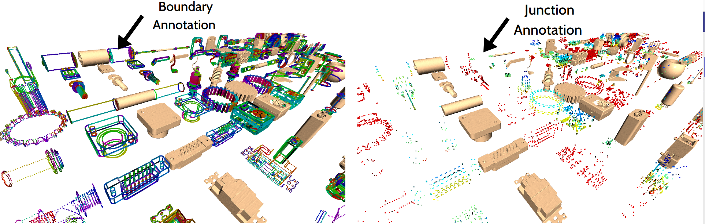

# 3D Scans Annotation with BRep Features  

This project serves as data + annotation preparation for Scan2BRep project developped by Sk Aziz Ali, at the German Research Center for Artificial Intelligence (DFKI GmbH). In summary, BRep **boundary**, **junction/corner**, and **face** related attribbutes and their Ids are assigned to corresponding 3D scan points. These annotations define membership status for 3D Scan points to its BRep structural compositions. We have prepared annotations for two dataset -- [**CC3D**](https://orbilu.uni.lu/bitstream/10993/43746/1/cherenkova_icip2020_pvdeconv_cc3d.pdf) and [**ABC**](https://deep-geometry.github.io/abc-dataset/). 

### List of Annotations


### Setting up the environment (Ubuntu 22.04)

```bash
conda env create -f environment.yml
conda activate membership_transfer
```

## Data Preparation and Downloads for Scan-to-BRep 
*	**CC3D Data Downloads:** Proceed towards download+license agreement prosess for the CC3D dataset [**here**](https://cvi2.uni.lu/cc3d/)
*	**ABC Data Downloads:** Proceed towards download steps for the ABC dataset [**here**](https://deep-geometry.github.io/abc-dataset/). Since the dataset is huge and require downloading in bulk, an easier routine is given here -> ```"./Scan2BRep_AnnotPrepCode/utils/download_chunks.py"```

*	**CC3D / ABC Data Preparation:** Once the data are downloaded, the annotation prepration steps can be followed [**here**](./Scan2BRep_AnnotPrepCode/README.md). We have incremented the resolution of triangular meshes of ABC dataser (i.e., 'path/to/dataset/obj' chunks). Therefore, one needs to use obj files downladable from here ()

Note that both the datasets and their annotations combined can occupy a storage space upto **600GB**. In general, the following folder structures would ideally suit accessability and relative dependencies between files. 
 	
*	For ABC dataset, the files and folder structure is:

```bash
ABC_filter/
┣ abc_v1.0_BoundaryLabels/		# For Boundary Annotations
┃  ┣ abc_0000_step_v00                       	
┃  ┣ abc_0001_step_v00                       	
┃  ┣ ..                       			
┣ abc_v1.0_JunctionLabels/		# For Junction Annotations
┃  ┣ abc_0000_step_v00                       	
┃  ┣ abc_0001_step_v00                       	
┃  ┣ .. 
┣ abc_v1.0_BRepFaceLabels/		# For Face Annotations
┃  ┣ abc_0000_step_v00                       	
┃  ┣ abc_0001_step_v00                       	
┃  ┣ .. 
┣ obj/					# High Resolution CAD models of ABC
┃  ┣ abc_0000_step_v00                       	
┃  ┣ abc_0001_step_v00                       	
┃  ┣ ..
┣ step/					# BRep kernels in .STEP files
┃  ┣ abc_0000_step_v00                       	
┃  ┣ abc_0001_step_v00                       	
┃  ┣ ..
┣ train.txt
┣ test.txt
┣ val.txt
┗
```

*	For CC3D dataset, the files and folder structure is:

```bash
CC3D_filter/
┣ cc3d_v1.0_BoundaryLabels/		# For Boundary Annotations
┃  ┣ train/  
┃  ┣	┣ batch_01/Model_Id/ModelName.ply
┃  ┣	┣ batch_01/Model_Id/ModelName.ply   
┃  ┣	┣ .. 
┃  ┣	┣ batch_10/Model_Id/ModelName.ply
┃  ┣	┣ batch_10/Model_Id/ModelName.ply                    	
┃  ┣ test/     
┃  ┣	┣ ...                  	
┃  ┣ val/   
┃  ┣	┣ ...                    			
┣ cc3d_v1.0_JunctionLabels/		# For Junction Annotations
┃  ┣ test/     
┃  ┣	┣ ...                  	
┃  ┣ val/
┃  ┣	┣ ...                       	                      	
┃  ┣ .. 
┣ cc3d_v1.0_BRepFaceLabels/		# For Face Annotations
┃  ┣ test/     
┃  ┣	┣ ...                  	
┃  ┣ val/
┃  ┣	┣ ...                      	                       	
┃  ┣ .. 
┣ cc3d_v1.0_scans/			# High Resolution Scans models of CC3D
┃  ┣ test/     
┃  ┣	┣ ...                  	
┃  ┣ val/  
┃  ┣	┣ ...                   	
┃  ┣ ..
┣ cc3d_v1.0_step/			# BRep kernels in .STEP files
┃  ┣ test/     
┃  ┣	┣ ...                  	
┃  ┣ val/  
┃  ┣	┣ ...                   	
┃  ┣ ..
┣ train.txt
┣ test.txt
┣ val.txt
┗
```

### Run the BREP_Boundary-to-SCAN Labeling

* **for CC3D dataset**

	```bash
	python3 -m BRep2CADLabler labelBRep2Scan 
	--step_path /path/to/your/stepfile/ 
	--scan_path /path/to/your/scanfile/ 
	--output /path/to/your/output/ --nProc 8 
	--scale_brep=True --infmt .step --ofmt .npz
	```

* **for ABC dataset**

	```bash
	python3 -m BRep2CADLabler labelBRepBndry2ScanABC 
	--step_path /path_to/ABC_filter/step/ 
	--scan_path /path_to/ABC_filter/obj/
	--output /path_to//ABC_filter/abc_v1.0_BoundaryLabels/
	--scale_brep True --nProc 8 --infmt .step --ofmt .npz
	```

### Run the BREP_Junction-to-SCAN Labeling
* **for CC3D dataset**

	```bash
	python3 -m BRep2CADLabler labelBRep2Scan 
	--step_path /path/to/your/stepfile/ 
	--scan_path /path/to/your/scanfile/ 
	--output /path/to/your/output/ --nProc 8 
	--scale_brep=True --infmt .step --ofmt .npz
	```
	
* **for ABC dataset**

	```bash
	python3 -m BRep2CADLabler labelBRepJunction2ScanABC 
	--step_path /path_to/ABC_filter/step/ 
	--scan_path /path_to/ABC_filter/obj/
	--output /path_to//ABC_filter/abc_v1.0_JunctionLabels/
	--scale_brep True --nProc 8 --infmt .step --ofmt .npz
	```

### Run the BREP_Face-to-SCAN Labeling

* **for CC3D dataset**

	```bash
	python3 -m BRep2CADLabler labelBRepFace2Scan 
	--step_path /path/to/CC3D_filter/cc3d_v1.0_step/train/$s 
	--scan_path /path/to/CC3D_filter/cc3d_v1.0_fusion/train/$s 
	--output /path/to/CC3D_filter/cc3d_v1.0_BRepFaceLabels/train/$s 
	--nProc 8 --infmt .step --ofmt .npz
	```

* **for ABC dataset**

	```bash
	python3 -m BRep2CADLabler labelBRepFace2ScanABC 
	--step_path /path/to/ABC_filter/step/$s 
	--scan_path /path/to/ABC_filter/obj/$m 
	--output /path/to/ABC_filter/abc_v1.0_BRepFaceLabels/$s 
	--nProc 70 --infmt .step --ofmt .npz
	```

The flag **--ofmt**, i.e. output format of the annptation file, can be either of (.npz | .ply | .pkl).
* .npz --> format will output annotations save in zipped numpy array type files	
* .pkl --> format will save the 3D BRep
* .ply --> format will save the BRep features transferred to 3D scans 

### Compute Quality Measures 
	
Quality measures between cad models and 3D scan w.r.t the annotations

	```bash
	python3 -m QualityMeasure ComputeAnnotationQuality 
	--brep_path /path/to/test/batch_01/ 
	--annot_path /path/to/cc3d_v1.0_BRepAnnot/test/batch_01/ 
	--cad_path /path/to/cc3d_v1.0_cad/test/batch_01/ 
	--scan_path /path/to/cc3d_v1.0_scan/test/batch_01/  
	--output_path /path/to/cc3d_v1.0_STATS/test/batch_01/ --nProc 6
	```

