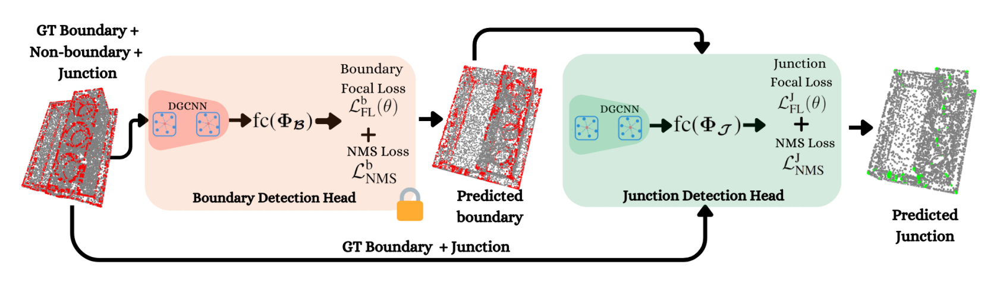

# BRep Boundary and Junction Detection for CAD Reverse Engineering (IEEE ICMI24)
[](https://www.dfki.de/fileadmin/user_upload/import/14858_ICMI151.pdf)     [](./BRepDetNet_MediaAssets/BRepDetNet.mp4)  [](https://skazizali.com/brepdetnet.github.io/)

[*Sk Aziz Ali*](https://skazizali.com/), [*Mohammad Sadil Khan*](https://av.dfki.de/members/sadil-khan/), [*Didier Stricker*](https://av.dfki.de/members/stricker/)



BRepDetNet: A deep learning-based approach for detecting boundary representation structures from 3D scans. This approach changes 3D scan data into a parametric CAD model through the detection of BRep boundaries and junctions using annotated CC3D and ABC datasets to perform the Scan-to-CAD process more efficiently and enable feature-based modeling.

# Dependency Installation

## Setup Conda Environment:

*   Setup the Environment variables for the CC3D and ABC Datasets by running the `dataset_env.sh` script [**here**](BRepDetNet_ModelImpl/dataset_env.sh)

    ```bash
    source ./dataset_env.sh
    ```

*   Create a conda environment 
    ```bash
    conda env create -f environment.yml
    conda activate Scan2BRep
    ```


# Datasets and Annotations

*	**CC3D Data Downloads:** Proceed towards download+license agreement prosess for the CC3D dataset [**here**](https://cvi2.uni.lu/cc3d/)
*	**ABC Data Downloads:** Proceed towards download steps for the ABC dataset [**here**](https://deep-geometry.github.io/abc-dataset/). Since the dataset is huge and require downloading in bulk, an easier routine is given here -> ```"./Scan2BRep_AnnotPrepCode/utils/download_chunks.py"```
*	For Data preparation, refer [**here**](BRepDetNet_AnnotPrep/README.md)
*   To **train** the BRepDetNet model, we release the ~35K high-resolution meshes, their corresponding .step files for BRep, Bounday Labels, Junction Labels, and Face Labels. 


# BRep Boundary + Junction Detection Network
One of the primary task is to train neural networks for BRep **Boundary** and **Junctoin/Corner** detection from a given 3D Scan. For training scripts and more details on the implementation proceed [**here**](BRepDetNet_ModelImpl/README.md)

## Citation
```
@inproceedings{BRepDetNet_ICMI2024,
  title = {BRep Boundary and Junction Detection for CAD Reverse Engineering},
  author = {Ali, Sk Aziz and Khan, Mohammad Sadil and Stricker, Didier},
  booktitle = {IEEE International Conference on Computing and Machine Intelligence (ICMI)},
  year = {2024},
  organization = {IEEE},
}
```


## Acknowledgment
Authors thank Dr. Anis Kacem and Prof. Dr. Djamila Aouada for sharing appropriate inputs on understanding BRep. 

This code has been cleaned up and structured by two undergraduate students - [Bhavika Baburaj](https://github.com/bhavikab04) and [Pritham Kumar Jena](https://github.com/prithamkjena), from BITS Pilani, Hyderabad Campus.


## License
This project is licensed under BSD v3. Please see the LICENSE file. &copy; Copyright German Research Center for AI (DFKI GmbH) and BITS Pilani, Hyderabad, all rights reserved 
